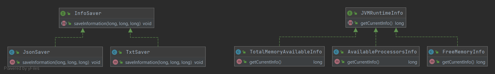

# JVMRuntimeInfoExtractor

## 1. Stworzenie ogólnego modelu

## 2. Lista cech
* Pobieranie danych o dostępnej oraz wolnej pamięci RAM **(w MB)** dla środowiska JVM, a także o dostępnych dla niej procesorów logicznych.
* Zapisywanie pobranych danych w formie tekstowej w pliku .txt oraz jako JSON w pliku .json

## 3. Zaplanowanie implementacji cech
Zaimplementujcie aplikację, która będzie posiadała 2 podstawowe feature'y:
* Pobierała dane o dostępnej oraz wolnej pamięci RAM **(w MB)** dla środowiska JVM, a także o dostępnych dla niej procesorów logicznych.
* Zapisywała te dane w formie tekstowej w pliku .txt oraz jako JSON w pliku .json

W tym celu podzielcie się na 2 grupy (2 i 3 osoby).

### Grupa 1 (3 osoby)
Waszym zadaniem jest zaimplementowanie 3 klas *AvailableProcessorsInfo*, *FreeMemoryInfo* oraz *TotalMemoryAvailableInfo*, które implementują interfejs *JVMRuntimeInfo*.
**Pamiętajcie, że chcemy uzyskać informację o dostępnej pamięci w MB!**

**Wskazówki:**

* [Jak otrzymać dane o dostępnej/wolnej pamięci oraz o ilości dostępnych procesorów](https://stackoverflow.com/a/25596)
* Aby otrzymać ilość w MB, wystarczy podzieliść ilość B przez 1024*1024

### Grupa 2 (2 osoby)
Waszym zadaniem jest zaimplementowanie 2 klas *JsonSaver* oraz *TxtSaver* implementujących interfejs *InfoSaver*.
Do obsługi JSON'a użyjcie biblioteki [JSON-Simple](https://code.google.com/archive/p/json-simple/)

**Wskazówki:**

* [Tutorial zapisu do JSON](https://howtodoinjava.com/java/library/json-simple-read-write-json-examples/)
